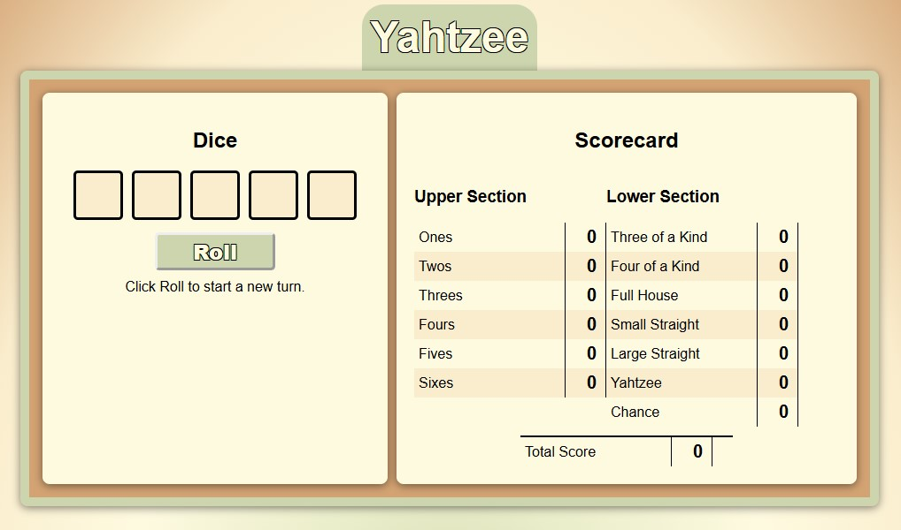

# 🎲 Yahtzee Plus 🎲



## Your Game’s Name: **Yahtzee Plus**

**Yahtzee Plus** takes the classic game of Yahtzee and adds a modern twist focused on expandability. While it delivers a familiar Yahtzee experience, the code is designed for flexibility—allowing you to customize dice, rules, scoring conditions, and unique modifiers with ease.

---

### 🚀 Getting Started

- **Quick Play**: [Click Here](https://mike-gustafson.github.io/Yahtzee-Plus/)
- **Developer Mode**: Fork and clone the repo to deploy locally and start customizing!

---

### 🔗 Attributions

ChatGPT: datasets such as various dice configurations and a standard Yahtzee scorecard (scoring functions excluded).

---

### 🛠 Technologies Used

- **JavaScript**
- **HTML**
- **CSS**

---

### 📈 Next Steps

- **Backend Development**: Implement user accounts, score saving, and a high score leaderboard.
- **In-Game Rewards**: Introduce points earned based on game score, redeemable for game-enhancing modifiers (e.g., extra rerolls, wild dice, even-numbered dice only).
- **Customization Options**: Allow players to select unique modifiers from their collection for each game.

---

### File Tree


```
.
├── assets
│   ├── screeenshot.jpg             screenshot of webpage, used in readme
├── data
│   ├── dice.js                     object with various types of dice
│   ├── domElements.js              an object of exiting DOM elements, used to create global references. "name" name and "id" is the id of the element
│   ├── domStates.js                object of various DOM states with display/hidden attributes.  Used to easily trigger viewable states via domState function
│   ├── instructions.js             object with instructions, used to render "instructions" modal in ./modals.settings-modal.js
│   └── scorecard.js                object with scorecard.  includes all functions to calculate scores
│   └── settings.js                 object with settings, used to render "settings" modal in ./modals/settings-modal.js
├── js
│   ├── createEventListeners.js     set up most of the event listeners for the game.
│   ├── initModals.js               contains async functions to create and attach modals using files in ./modals
│   ├── mapDomElements.js           function to map DOM elements to global references for use in the game
├── modals                          
│   ├── instructions-modal.js       constructs and returns instructionsModal to initModals function in ./js/initModals.js
│   └── settings-modal.js           constructs and returns settingsModal to initModals function in ./js/initModals.js, uses data from ./data/settings.js
├── app.js                          primary JavaScript file
├── index.html                      primary HTML file
├── readme.md                       readme file for project
└── style.css                       primary CSS file
```