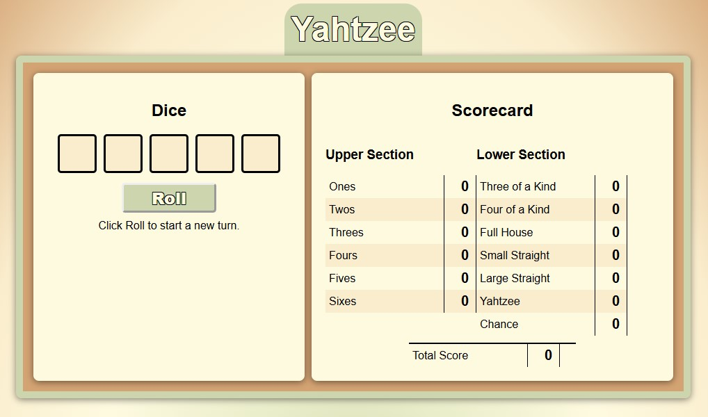

# 🎲 Yahtzee Plus 🎲

## Your Game’s Name: **Yahtzee Plus**

**Yahtzee Plus** takes the classic game of Yahtzee and adds a modern twist focused on expandability. While it delivers a familiar Yahtzee experience, the code is designed for flexibility—allowing you to customize dice, rules, scoring conditions, and unique modifiers with ease.

---

### 🚀 Getting Started

- **Quick Play**: [Click Here](https://mike-gustafson.github.io/Yahtzee-Plus/)
- **Developer Mode**: Fork and clone the repo to deploy locally and start customizing!

---

### 🔗 Attributions

ChatGPT: datasets such as various dice configurations and a standard Yahtzee scorecard (scoring functions excluded).

---

### 🛠 Technologies Used

- **JavaScript**
- **HTML**
- **CSS**

---

### 📈 Next Steps

- **Backend Development**: Implement user accounts, score saving, and a high score leaderboard.
- **In-Game Rewards**: Introduce points earned based on game score, redeemable for game-enhancing modifiers (e.g., extra rerolls, wild dice, even-numbered dice only).
- **Customization Options**: Allow players to select unique modifiers from their collection for each game.

---
